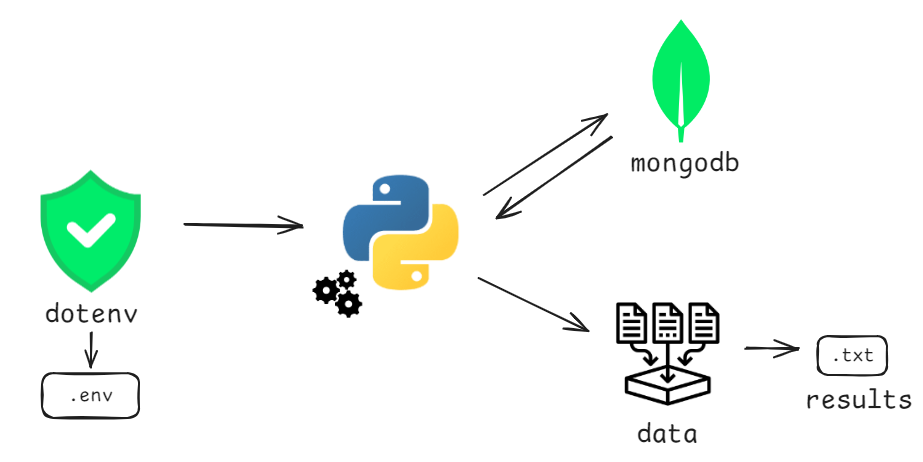

# Revisión Estados Procesales

El proyecto se enfoca en automatizar la búsqueda de estados procesales emitidos por la rama judicial. El proceso consiste en localizar el número de estado dentro de los archivos PDF que se encuentran en la carpeta designada para cada juzgado correspondiente. Esta búsqueda facilita la identificación y seguimiento de los estados procesales de manera eficiente.

# Arquitectura




## Instalación


```
git clone https://github.com/jgarteag/buscador-estados-rama-judicial
```
```
pip install -r requirements.txt
```
- Ingresar el pdf correspondiente a los estados procesales en la carpeta *pdf* de cada juzgado
- Ejecutar ```buscador.py```
- Visualizar resultados en la carpeta *revision*
    